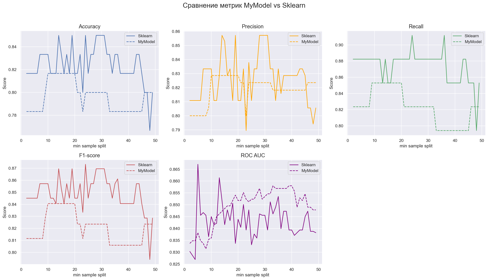

# Проект: Градиентный бустинг для классификации с нуля (MyBoostClf)

## Введение

Проект реализует **градиентный бустинг деревьев решений для бинарной классификации** на Python **без использования библиотек машинного обучения** (`scikit-learn`, `xgboost`, `lightgbm` и т.д.).  
В основе — собственные реализации базового регрессионного дерева `MyTreeReg` и ансамбля `MyBoostClf`, поддерживающие стохастическое обучение, регуляризацию, метрики качества и раннюю остановку.

### Основные возможности

- Градиентный бустинг с `n_estimators` базовыми деревьями  
- Логистическая функция потерь (Log Loss)  
- Поддержка стохастического сэмплирования признаков и объектов (`max_features`, `max_samples`)  
- Второй порядок оптимизации (градиенты и гессианы)  
- Регуляризация значений листьев (`reg`)  
- Ранняя остановка по метрике (`early_stopping`)  
- Пользовательская метрика (`accuracy`, `f1`, `roc_auc` и др.)  
- Подсчёт важности признаков  
- Гибкий темп обучения (`learning_rate`) — число или функция (шедулер)

---

## Теория

### Основная идея

Модель **итеративно улучшает логиты (оценки вероятностей)**, добавляя слабые модели — деревья решений, обученные на отрицательные градиенты функции потерь.  
Каждая итерация минимизирует логистическую ошибку, уточняя вероятности принадлежности к классу `1`.

---

## Алгоритм

**Инициализация.**  
Начальные предсказания \( f^{(0)} \) вычисляются как логарифм отношения долей классов:

$$
f^{(0)} = \log\frac{p}{1 - p}, \quad p = \frac{1}{n} \sum_i y_i
$$

**Для каждой итерации \( m = 1..M \):**

Вычисляются **градиенты** и **гессианы** логистической функции потерь:

$$
g_i = \hat{p}_i - y_i, \quad
h_i = \hat{p}_i (1 - \hat{p}_i), \quad
\hat{p}_i = \sigma\!\big(f^{(m-1)}(x_i)\big) = \frac{1}{1 + e^{-f^{(m-1)}(x_i)}}
$$

Случайно выбираются подмножества **объектов** и **признаков** (`max_samples`, `max_features`).

Обучается дерево `MyTreeReg` для аппроксимации отрицательного градиента.

Значения листьев корректируются по формуле второго порядка (аппроксимация Тейлора):

$$
\gamma = -\frac{\sum_i g_i}{\sum_i h_i}
       = \frac{\sum_i (y_i - \hat{p}_i)}{\sum_i \hat{p}_i (1 - \hat{p}_i)}
$$

Обновляются логиты (предсказания модели):

$$
f^{(m)}(x) = f^{(m-1)}(x) + \eta_m \cdot \gamma
$$

При наличии валидационного набора оценивается улучшение метрики;  
при отсутствии улучшений несколько итераций подряд выполняется **early stopping**.

---

## Модель дерева (`MyTreeReg`)

### Критерий разбиения

На каждом узле выбирается признак и порог, дающие **максимальное уменьшение дисперсии** целевой переменной:

$$
\Delta = \text{Var}(y) - \frac{n_L}{n}\text{Var}(y_L) - \frac{n_R}{n}\text{Var}(y_R)
$$

### Значения листьев

Листовые узлы принимают среднее значение по градиентам, после чего корректируются по формуле второго порядка.

---

## Регуляризация

- **learning_rate** — коэффициент, уменьшающий вклад каждой модели  
- **max_features**, **max_samples** — стохастическое сэмплирование  
- **max_depth**, **min_samples_split**, **max_leafs** — контроль сложности деревьев  
- **reg** — сглаживание значений листьев  
- **early_stopping** — остановка при отсутствии улучшений по метрике

---

## Метрики

Поддерживаются стандартные метрики бинарной классификации:

- `accuracy`
- `precision`
- `recall`
- `f1`
- `roc_auc`

---

## Параметры MyBoostClf

| Параметр            | Тип               | Описание |
|----------------------|-------------------|-----------|
| `n_estimators`       | int               | Количество деревьев |
| `learning_rate`      | float \| callable | Темп обучения или шедулер |
| `max_depth`          | int               | Максимальная глубина дерева |
| `min_samples_split`  | int               | Минимальное число объектов в узле |
| `max_leafs`          | int               | Максимальное количество листьев |
| `max_features`       | float             | Доля признаков для каждого дерева |
| `max_samples`        | float             | Доля объектов для каждого дерева |
| `metric`             | str \| None       | Метрика (`accuracy`, `f1`, `roc_auc`, и др.) |
| `reg`                | float             | Регуляризация значений листьев |
| `bins`               | int \| None       | Количество бинов для дискретизации признаков |
| `random_state`       | int               | Фиксация случайности |
| `early_stopping`     | int \| None       | Количество итераций без улучшений |

---

## Сравнение собственной и встроенной реализаций

* Были взяты значения по умолчанию

## Зависимость метрик от количества моделей
* Максимальное количество листьев - значения по умолчанию
* Максимальная глубина дерева - значения по умолчанию

## Зависимость метрик от глубины деревьев
* Максимальное количество листьев - 100
* Количество моделей - 20

## Зависимость метрик от количества листьев
* Максимальная глубина - 10
* Количество моделей - 20

## Зависимость метрик от минимального разделения
* Максимальная глубина - 5
* Количество моделей - 20
* Максимальное количество листьев - 20

